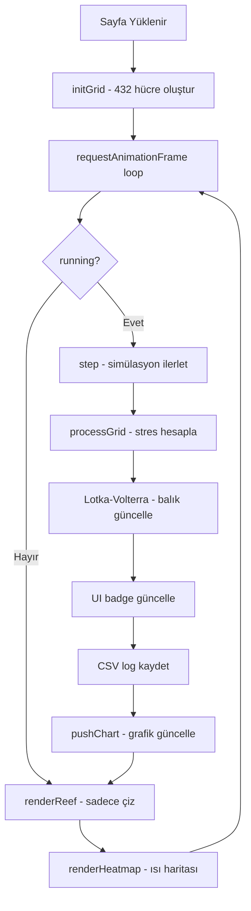

# 🪸 Coral Reef Stress & Bleaching Monitor — Proje Dokümantasyonu

> **Dosya:** `coral_simulation_final.html`  
> **Teknolojiler:** HTML5, CSS3, JavaScript (vanilla), Chart.js 4.4.1, Google Fonts (Inter)  
> **Toplam Satır:** ~3050  
> **Tek dosya uygulaması** — harici bağımlılık yok (CDN hariç)  
> **Ek Dosyalar:** `coral_simulation_dataset.csv`, `pacific_map_bg.png`, `README.md`

---

## 1. Projeye Genel Bakış

Bu uygulama, mercan resiflerinin iklim değişikliği altındaki davranışını simüle eden interaktif bir ekolojik modelleme aracıdır. 2013–2100 yılları arasını kapsayan simülasyon, gerçek NOAA verilerine dayanır ve IPCC SSP2-4.5 senaryosunu kullanarak geleceğe projeksiyon yapar.

**Ana Özellikler:**
- 24×18 hücrelik grid tabanlı mercan resif haritası
- Gerçek zamanlı IDW (Inverse Distance Weighting) interpolasyonlu ısı haritası
- Lotka-Volterra av-avcı balık popülasyonu dinamikleri
- Kapsamlı iklim politikası kontrol paneli (14 kaldıraç)
- Deniz Koruma Alanları (MPA) çizim sistemi
- Erken Uyarı Sistemi (EWS)
- CSV veri dışa aktarma (canlı satır sayacı)
- Bölge karşılaştırma modu
- 4 farklı ısı haritası görünümü (SST, Coral, Prey, Predator)
- **5 Pasifik bölgesi** (American Samoa, Main Hawaiian Islands, Mariana Archipelago, Northwestern Hawaiian Islands, Pacific Remote Island Areas)
- **Mini Dünya Haritası** — Uydu arka planlı, tıklanabilir bölge noktaları
- **2100 Projeksiyon Tahmini** — Canlı hesaplanan sağlık yüzdesi
- **Simülasyon Sonu Değerlendirmesi** — Türkçe puan ve sonuç ekranı
- **Veri Kaynağı Footer** — NOAA NCRMP · NOAA NCEI · IPCC SSP2-4.5

---

## 2. Dosya Yapısı (Tek HTML İçinde)

```
mercanbeyaz/
├── coral_simulation_final.html  # Ana simülasyon (monolitik HTML/CSS/JS, ~3050 satır)
├── coral_simulation_dataset.csv # NOAA kaynak veri seti (21 kayıt, 5 bölge)
├── pacific_map_bg.png           # Mini harita uydu arka plan görseli
├── PROJECT_DOCUMENTATION.md     # Bu dosya
└── README.md                    # Türkçe kullanıcı kılavuzu

coral_simulation_final.html iç yapısı:
├── <head>
│   ├── Meta bilgileri & SEO
│   ├── Google Fonts (Inter) import
│   ├── Chart.js CDN import
│   └── <style> — Tüm CSS kuralları (~780 satır)
├── <body>
│   ├── .water-fx — Arka plan su efekti
│   ├── .app — Ana konteyner
│   │   ├── .left-panel — Sol panel (kontroller + harita)
│   │   │   ├── h1 + subtitle — Başlık
│   │   │   ├── Flex row: .badges + #stat-cards | #mini-map-wrap (sağ)
│   │   │   ├── .controls — Temel simülasyon kontrolleri
│   │   │   ├── .policy-panel — Politika kontrol paneli
│   │   │   └── .grid-container — Harita canvas + timeline
│   │   └── .right-panel — Sağ panel (grafikler + ısı haritası)
│   │       ├── .charts-stack — 4 adet Chart.js grafiği (tooltip'li)
│   │       └── .heatmap-overlay — Isı haritası modu
│   ├── Info Button (?) — Sağ alt köşe
│   ├── Info Panel — Bilgi modalı (Türkçe)
│   └── <footer> — Veri kaynağı + GitHub bağlantısı
└── <script> — Tüm JavaScript (~2250 satır)
```

---

## 3. CSS Tasarım Sistemi

### 3.1 Renk Paleti
| Kullanım | Renk | Hex |
|----------|------|-----|
| Arka plan | Koyu lacivert | `#0a1628` |
| Panel arka planı | Gradient | `#0d1f33 → #112840` |
| Kenarlıklar | Koyu mavi | `#1a3a5c` |
| Birincil vurgu | Cyan | `#00d4ff` |
| İkincil vurgu | Teal | `#00d4aa` |
| Uyarı | Sarı | `#fbbf24` |
| Tehlike | Kırmızı | `#f87171` |
| Projeksiyon | Turuncu | `#ff8800` |

### 3.2 Ana CSS Sınıfları
- **`.app`** — Dikey flex konteyner, `min-height: 100vh`
- **`.left-panel`** / **`.right-panel`** — Tam genişlik, dikey yığın
- **`.controls`** — Flex-wrap kontrol grubu, `gap: 10px`
- **`.badge`** — Gradient arka planlı durum rozetleri
- **`.btn`** — Hover efektli butonlar, `.active` durumu ile mavi gradient
- **`.grid-container`** — Sabit 500px yükseklik, siyah arka plan
- **`.policy-panel`** — Açılır-kapanır politika paneli
- **`.charts-stack`** — 240px yükseklikte yatay grafik sırası
- **`.heatmap-overlay`** — 480px yükseklikte ısı haritası modu
- **`.chart-card`** — Her grafik için kart, başlık + canvas

### 3.3 Animasyonlar
- **`projPulse`** — "PROJECTED" etiketi için nabız efekti
- **`fadeInUp`** — Simülasyon tamamlandı banner'ı için giriş animasyonu

---

## 4. Veri Katmanı

### 4.1 Gerçek Veri Seti (`DATA` + `coral_simulation_dataset.csv`)
NOAA NCRMP'den alınan **21 kayıt** (5 bölge, 2013–2023):

| Bölge | Yıl Aralığı | Kayıt Sayısı | Toplam Koloni |
|-------|------------|-------------|---------------|
| American Samoa | 2015–2023 | 4 | 85,436 |
| Main Hawaiian Islands | 2013–2019 | 3 | 47,641 |
| Mariana Archipelago | 2014–2022 | 3 | 72,981 |
| Northwestern Hawaiian Islands | 2014–2017 | 4 | 19,352 |
| Pacific Remote Island Areas | 2014–2023 | 7 | 43,195 |

CSV dosyası 17 sütun içerir: year, region, total_colonies, healthy_count, bleached_count, dead_count, avg_old_dead_pct, avg_recent_dead_pct, avg_colony_length_cm, latitude, longitude, healthy_pct, bleached_pct, dead_pct, global_bleaching_avg_pct, global_bleaching_records, coral_health_index

### 4.2 Bölge Koordinatları (`REGION_COORDS`)
NOAA NCRMP verisinden alınan gerçek koordinatlar:

| Bölge | Enlem | Boylam |
|-------|-------|--------|
| American Samoa | -14.28° | -169.47° |
| Main Hawaiian Islands | 20.79° | -156.99° |
| Mariana Archipelago | 16.53° | 145.38° |
| Northwestern Hawaiian Islands | 25.90° | -171.92° |
| Pacific Remote Island Areas | 5.09° | -164.03° |

### 4.3 Projeksiyon Çapaları (`PROJ_ANCHORS`)
IPCC SSP2-4.5 senaryosuna dayanan 9 veri noktası (2024–2100):

```
2024: +0.1°C, sağlık: 0.68
2050: +1.2°C, sağlık: 0.38
2100: +3.0°C, sağlık: 0.04
```

### 4.4 Tarihsel Ağartma Olayları (`BLEACHING_EVENTS`)
6 gerçek küresel ağartma olayı spike değerleriyle:
- 1998 (+2.1°C) — İlk küresel ağartma
- 2010 (+1.4°C)
- 2016 (+2.8°C) — Tarihin en kötüsü
- 2017 (+1.2°C)
- 2020 (+1.8°C)
- 2024 (+2.5°C) — Son büyük olay

---

## 5. Simülasyon Motoru

### 5.1 Grid Yapısı
- **Boyut:** 24 sütun × 18 satır = 432 hücre
- **Her hücre:** `{ state, stressLevel, localTemp }`
- **Durumlar:** HEALTHY → STRESSED → BLEACHED → DEAD → RECOVERING

### 5.2 Durum Geçiş Eşikleri
```
stressLevel ≤ 0.25  →  HEALTHY
stressLevel ≤ 0.55  →  STRESSED
stressLevel ≤ 0.82  →  BLEACHED (veya RECOVERING)
stressLevel > 0.82  →  DEAD
```

### 5.3 Sıcaklık Hesaplama Zinciri
```
globalTemp = sliderTemp + projDelta + emissionDelta
seasonalTemp = globalTemp + sin(month) × 1.5
finalTemp = seasonalTemp + eventSpike
localTemp = finalTemp + SimplexNoise × 3.0 + currentEffects
```

### 5.4 Stres Yayılım Modeli (`processGrid`)
Her tick'te her hücre için:
1. **Lokal sıcaklık** hesaplanır (gürültü + okyanus akıntıları)
2. **Stres çarpanları** belirlenir (turizm, MPA, EWS, GEF fon)
3. `localTemp > bleachThreshold` ise stres artar
4. Komşu hücrelerden **bulaşma** stresi eklenir
5. Ölü hücrelerin düşük sıcaklıkta **iyileşme** şansı

### 5.5 Okyanus Akıntıları
3 akıntı merkezi sinüs/kosinüs ile hareket eder:
- 2 akıntı ısıtıcı (+1.5°C etki, 8 hücre yarıçap)
- 1 akıntı soğutucu (-1.5°C etki)

### 5.6 Lotka-Volterra Balık Dinamikleri
```javascript
K = max(5, 100 × effectiveKIndex)   // Taşıma kapasitesi
dPrey = r×prey×(1 - prey/K) - α×prey×predator
dPred = β×prey×predator - δ×predator
// r=0.08, α=0.005, β=0.003, δ=0.04
```
Balıkçılık kotası `dPrey` üzerine ek etki yapar.

### 5.7 Restorasyon Mekanizması
```javascript
restorationChance = (budget/100) × 0.025 × (1 + gefFund/100)
// MPA içindeyse ×2 çarpan
// Başarılı ise: DEAD → RECOVERING (stress=0.75)
```

---

## 6. Render Sistemi

### 6.1 Ana Harita (`renderReef`)
- **IDW Interpolasyon:** 0.25× çözünürlükte off-screen canvas
- **Simplex Noise türbülansı:** Organik, akan görünüm
- **5×5 komşuluk** IDW ağırlıklama
- DPR (Device Pixel Ratio) desteği

### 6.2 Katmanlar (üstten alta)
1. IDW interpolasyonlu mercan sağlık haritası
2. Renk çubuğu (sağ kenar)
3. MPA koruma alanları (teal overlay + 🛡️ ikon)
4. EWS otomatik koruma (cyan overlay)
5. Çizim önizleme dikdörtgeni (beyaz kesikli)
6. Silme hover efekti (kırmızı + 🗑️)
7. Tarih/bölge/SST metin overlay'i
8. Politika uyarı çubuğu (kırmızı)
9. Duraklatma overlay'i
10. Ağartma olay etiketi

### 6.3 Isı Haritası Modu (`renderHeatmap`)
4 farklı görünüm, her biri özel paletli:

| Mod | Palet | Aralık |
|-----|-------|--------|
| SST | Mor→Mavi→Yeşil→Sarı→Kırmızı→Beyaz | 26–32°C |
| Coral | Mavi→Teal→Sarı→Kırmızı→Siyah | Sağlıklı→Ölü |
| Prey | Siyah→Lacivert→Mavi→Cyan | Yok→Yoğun |
| Predator | Siyah→Mor→Leylak→Pembe | Yok→Yüksek |

Balık haritalarında min-max normalizasyon + gamma düzeltme uygulanır.

### 6.4 Grafikler (Chart.js)
4 zaman serisi grafiği, her biri 120 veri noktası geçmişi tutar:
- **SST & DHW** — Çift dataset + olay üçgenleri
- **Coral Cover** — Yüzde bazlı
- **Prey Fish** — Popülasyon
- **Predator Fish** — Popülasyon

---

## 7. Politika Kontrol Paneli

### 7.1 Emisyon Kaynakları (Sol Sütun)
| Slider | Varsayılan | Etki Formülü |
|--------|-----------|--------------|
| 🏭 Coal & Industry | 50 | `(val/100) × 0.8` |
| ✈️ Aviation & Ship | 50 | `(val/100) × 0.4` |
| 🌾 Livestock & Rice | 50 | `(val/100) × 0.3` |
| 🌲 Forest Loss | 50 | `(val/100) × 0.3` |
| ⚡ Clean Energy Mix | 30 | `-(val/100) × 0.6` |
| 🔬 CCS Technology | 0 | `-(val/100) × 0.4` |

**Net Emisyon Etkisi** = Toplam - Baseline(0.75), sonuç `projDelta`'ya eklenir.

### 7.2 Okyanus & Resif Politikaları (Sağ Sütun)
| Kontrol | Tip | Etki |
|---------|-----|------|
| 🇺🇸 US Policy | Toggle | Devre dışı: `projDelta × 1.4` |
| 🇨🇳 CN Policy | Toggle | Devre dışı: `projDelta × 1.27` |
| 🇪🇺 EU Policy | Toggle | Devre dışı: `projDelta × 1.08` |
| 🌊 Alkalinity Enh. | Slider 0–100 | `bleachThreshold = 29 + (val/100)×2` |
| ✈️ Tourism Reg | Select (4) | Stres çarpanı: +0.3 ~ -0.1 |
| 🐟 Fishing Quota | Select (3) | Prey: -0.003 ~ +0.001 |
| 💰 GEF Reef Finance | Slider 0–100 | `recoveryMult += (val/100)×0.5` |
| 🚨 EWS | Checkbox | DHW>6 → 10 hücre otomatik koruma |

### 7.3 Politika Özet Çubuğu
4 canlı rozet: Net Warming, pH Risk, Fish, Policies — her tick güncellenir.

---

## 8. Deniz Koruma Alanları (MPA)

### 8.1 Çizim Sistemi
- **Mousedown:** Başlangıç hücresini kaydet
- **Mousemove:** Önizleme dikdörtgeni göster
- **Mouseup:** Dikdörtgeni finalize et, `protectedRects[]`'e ekle
- **Limit:** Toplam hücrelerin %40'ı (172 hücre)

### 8.2 Veri Yapısı
```javascript
protectedRects = [
  { cells: Set, minCol, minRow, maxCol, maxRow },
  ...
]
protectedCells = new Set()  // Tüm korunan hücre indeksleri
```

### 8.3 Koruma Etkileri
| Parametre | Normal | MPA İçi | Etki |
|-----------|--------|---------|------|
| stressAccMult | 1.0 | 0.23 | Stres birikimi %77 azalır |
| recoveryMult | 1.0 | 3.25 + GEF bonusu (×0.75) | İyileşme 3.25x hızlı |
| neighborMult | 1.0 | 0.3 | Bulaşma %70 azalır |
| restorationChance | ×1 | ×2 | Restorasyon şansı 2 kat |
| Aktif iyileşme | yok | `newStress -= 0.001 × recoveryMult` | Hafif ısınmada kendiliğinden iyileşir |

**Aktif iyileşme koşulu:** `localTemp < bleachThreshold + 1.5°C`

### 8.4 Silme
- **Hover:** Kırmızı overlay + 🗑️ ikonu
- **Sağ tık:** Tek dikdörtgen sil
- **"✕ Clear All"** butonu: Tümünü temizle

---

## 9. Erken Uyarı Sistemi (EWS)

```
Her tick sonunda:
  avgDHW > 6 → En stresli 10 hücreyi bul (ölü ve MPA hariç)
                tempProtected Set'ine ekle
                Bu hücrelerde stressAccMult × 0.55
  avgDHW < 4 → tempProtected temizle
```
Haritada cyan overlay ile gösterilir.

---

## 10. Karşılaştırma Modu

"⚖ Compare" butonuyla aktifleşir:
- Canvas ikiye bölünür
- İkinci bölge otomatik seçilir
- Aynı sıcaklık/politika koşullarında paralel simülasyon
- Her iki grid ayrı `processGrid()` çağrısıyla güncellenir

---

## 11. Timeline Scrubber

- **Aralık:** 0–2610 tick (2013–2100)
- **Kullanım:** Sürükleyince simülasyon o tick'e fast-forward yapılır
- **Optimizasyon:** Fast-forward sırasında `_skipChartUpdate = true`
- 2024+ yıllarında accent rengi turuncuya döner

---

## 12. CSV Veri Dışa Aktarma

### 12.1 Loglama
Her 3 tick'te bir (aylık) `simLog[]` dizisine kayıt eklenir.

### 12.2 CSV Sütunları
```
tick, year, month, region, sst, dhw, avg_stress,
coral_cover_pct, healthy_pct, bleached_pct, dead_pct,
recovering_pct, prey_population, predator_population,
protected_pct, budget_million_usd, us_policy, china_policy,
eu_policy, active_policies, industrial_co2, transport_emissions,
agricultural_ch4, deforestation_rate, renewable_share,
carbon_capture, alkalinity_enhancement, tourism_regulation,
fishing_quota, is_projected, projected_2100_health_pct
```

**Not:** `coral_cover_pct` = `(healthy + bleached + recovering) / total × 100` olarak hesaplanır.

### 12.3 Canlı Satır Sayacı
CSV butonunun sağ üst köşesinde yeşil badge ile toplam kayıt sayısı canlı olarak güncellenir.

### 12.4 İndirme
"⬇ CSV" butonu `downloadCSV()` fonksiyonunu çağırır, Blob API ile dosya oluşturur.

---

## 13. Simplex Noise Implementasyonu

Tamamen inline, bağımlılıksız 2D Simplex Noise:
- 256 elemanlı permütasyon tablosu
- 8 gradient vektörü
- F2/G2 skew faktörleri
- Kullanım alanları: Sıcaklık gürültüsü, türbülans, akıntı efektleri

---

## 14. Bilimsel Modeller Özeti

| Model | Kaynak | Uygulama |
|-------|--------|----------|
| DHW Eşik Modeli | NOAA Coral Reef Watch | DHW < 4: güvenli, 4–8: ağarma, ≥8: ölüm |
| Kontagyon Yayılımı | Orijinal | Komşu hücrelerden stres bulaşması |
| Lotka-Volterra | Klasik ekoloji | Av-avcı popülasyon dengesi |
| SSP2-4.5 | IPCC AR6 | 2024–2100 sıcaklık projeksiyonu |
| IDW İnterpolasyon | Shepard (1968) | Uzaysal yumuşatma |

---

## 15. Kullanıcı Arayüzü Akışı



---

## 16. Performans Optimizasyonları

1. **Off-screen rendering:** 0.25× çözünürlükte hesaplama, sonra upscale
2. **Float32Array:** Stres değerleri için typed array
3. **Chart.js `update('none')`:** Animasyonsuz güncelleme
4. **`_skipChartUpdate` flag:** Timeline scrub sırasında grafik devre dışı
5. **`LOG_INTERVAL = 3`:** Her tick değil, her 3 tick'te CSV log

---

## 17. Durum Değişkenleri Referansı

| Değişken | Tip | Varsayılan | Açıklama |
|----------|-----|-----------|----------|
| `tick` | number | 0 | Simülasyon adımı |
| `exactYear` | number | 2013 | Ondalıklı yıl |
| `temperature` | number | 28 | Mevcut SST |
| `prey` | number | 50 | Av balık popülasyonu |
| `predator` | number | 10 | Avcı balık popülasyonu |
| `simSpeed` | number | 1 | 0=duraklat, 1=normal, 3=hızlı |
| `grid[]` | Array | 432 hücre | Ana resif durumu |
| `grid2[]` | Array | [] | Karşılaştırma grid'i |
| `protectedCells` | Set | boş | MPA hücre indeksleri |
| `tempProtected` | Set | boş | EWS otomatik koruma |
| `usPolicyActive` | bool | true | ABD iklim politikası |
| `chinaPolicyActive` | bool | true | Çin iklim politikası |
| `euPolicyActive` | bool | true | AB iklim politikası |
| `bleachThreshold` | number | 29 | Ağarma sıcaklık eşiği |
| `tourismLevel` | number | 2 | 0–3 turizm düzeni |
| `fishingQuota` | number | 1 | 0–2 balıkçılık kotası |
| `imfFund` | number | 0 | Uluslararası fonlama |
| `ewsActive` | bool | false | Erken uyarı sistemi |
| `industrialCO2` | number | 50 | Endüstriyel emisyon |
| `simLog[]` | Array | [] | CSV veri kaydı |

---

## 18. Mini Dünya Haritası

### 18.1 Yapı
- **Canvas:** 200×110px, `pacific_map_bg.png` uydu arka planı
- **Projeksiyon:** Pasifik merkezli Mercator-lite (`miniMapProj` fonksiyonu)
- **Bölge noktaları:** 5 tıklanabilir marker, seçili olan yeşil glow efektli

### 18.2 Etkileşim
- Noktaya tıklandığında bölge değişir (20px hit radius)
- Koordinat bilgisi (Lat/Lon) haritanın altında güncellenir
- Bölge dropdown'u otomatik senkronize olur

---

## 19. 2100 Projeksiyon Tahmini

Mevcut politika ayarlarına göre 2100 yılındaki tahmini mercan sağlığı canlı olarak hesaplanır:

```
emEffect = (industrialCO2×0.8 + transport×0.4 + agri×0.3 + deforest×0.3 - renewable×0.6 - ccs×0.4) / 100
policyMult = US_off?×1.4 × CN_off?×1.27 × EU_off?×1.08
estimatedHealth = (1 - netTempDelta/5) × 30 + pH_bonus + budget_bonus + MPA_bonus + GEF_bonus
```

Renk kodlaması: %40+ yeşil, %20-40 sarı, %20 altı kırmızı.

---

## 20. Simülasyon Sonu Değerlendirmesi

2100 yılına ulaşıldığında Türkçe sonuç ekranı:

| Sağlıklı % | Emoji | Mesaj | Renk |
|-----------|-------|-------|------|
| ≥40% | 🏆 | MERCANLARI KURTARDIN! | Yeşil |
| 25–40% | ⚠️ | KRİTİK AMA UMUT VAR | Sarı |
| 10–25% | 🔻 | CİDDİ GERİLEME | Turuncu |
| <10% | 💀 | EKOSİSTEM ÇÖKTÜ | Kırmızı |

---

## 21. Veri Kaynakları

1. **NOAA NCRMP** — 269,356 yetişkin mercan koloni gözlemi (2013–2023), 5 Pasifik bölgesi
2. **NOAA NCEI** — Küresel Mercan Ağartma Veritabanı (Accession 0228498), 35,991 kayıt
3. **NOAA NCRMP STR** — Kalıcı resif noktalarında su altı sıcaklık kaydedicileri, 0–30m derinlik
4. **IPCC AR6** — SSP2-4.5 orta emisyon senaryosu

Sayfa altında footer olarak gösterilir: `Data: NOAA NCRMP · NOAA NCEI · IPCC SSP2-4.5`

---

*Bu dokümantasyon `coral_simulation_final.html` dosyasının tüm sistemlerini kapsar.*  
*Son güncelleme: Mayıs 2026*
